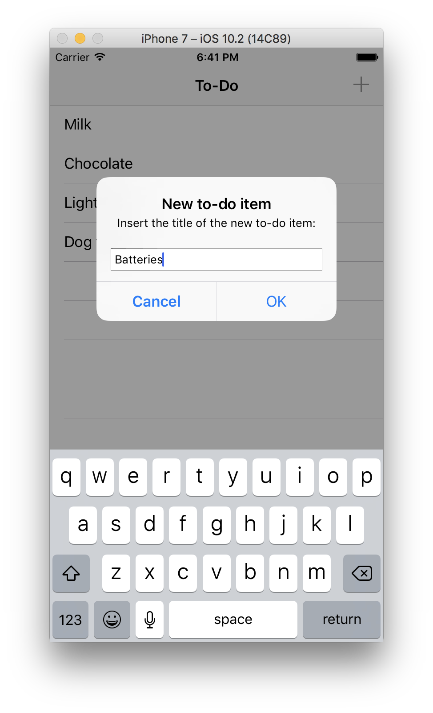

# Todo-List

This is another tutorial for the Deerfield App Development Club. You will make your own todo list app. 

  

## Introduction

In this tutorial we will cover the implementation of a basic iOS App in Swift that allows us to keep a to-do list.

The tutorial will cover the following areas:

1. Setting up an iOS App project in Xcode

2. Building a simple UI structure using Interface Builder

3. Creating a data model

4. Connecting the data model to the UI using a View Controller

5. Implementing serialization to achieve local persistence

This tutorial doesn't involve any third-party libraries. The objective is to make this as simple as possible and without any dependencies. Even if you have never written any apps for iOS, you should be able to follow along. I will assume you are interested in learning some small but important details regarding iOS and Swift, and will throw some trivia and explanations along the way.

So let's get started!

[Please refer to this tutorial](https://www.brunophilipe.com/blog/articles/swift-tutorial-mytodo/)

## Contact & Info

If you have any questions, comments or concerns, please contact Neil at ynie19@deerfield.edu